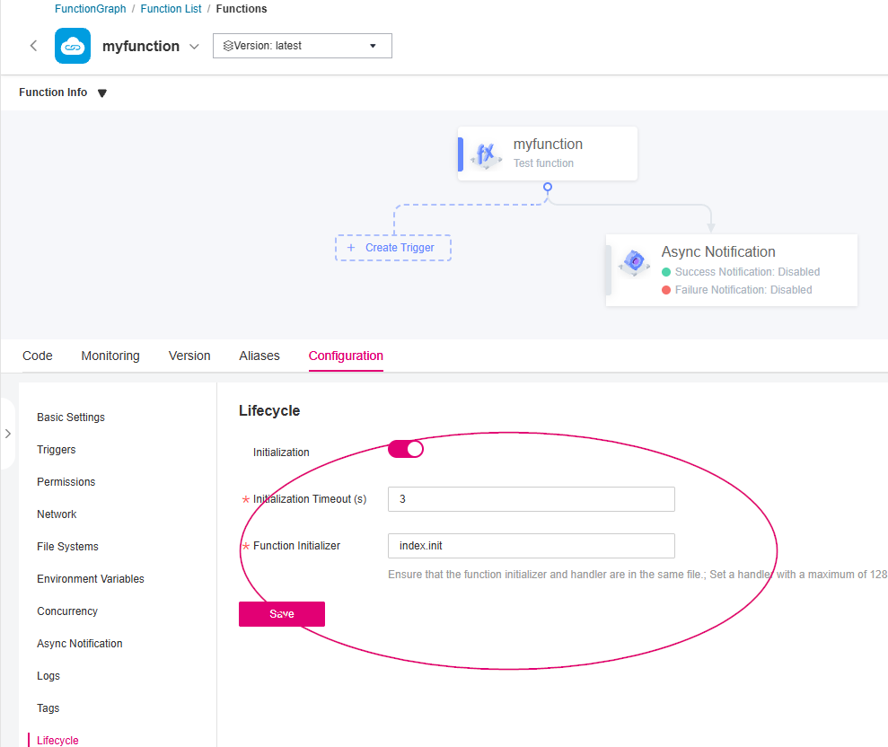
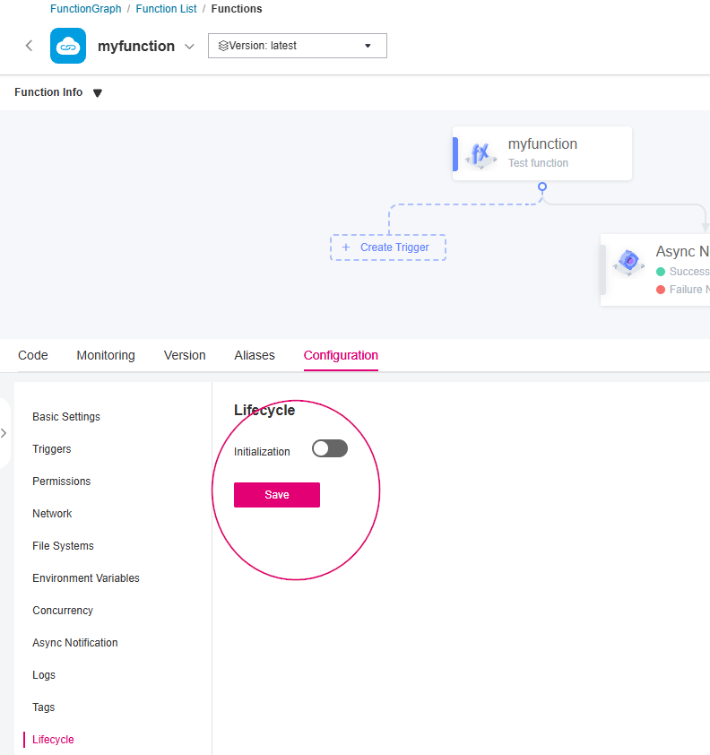

# bug-fg-initializer-tf

Sample code for https://github.com/opentelekomcloud/terraform-provider-opentelekomcloud/issues/3403


Following environment variables must be set:

| Environment variable | description                                     |
| -------------------- | ----------------------------------------------- |
| OTC_SDK_AK           | Access key                                      |
| OTC_SDK_SK           | Secret key                                      |
| OTC_SDK_DOMAIN_NAME  | Domain name eg. OTC-EU-DE-000000000010000XXXXX" | 
| OTC_SDK_PROJECTNAME  | Project name e.g. eu_de                         |
| OTC_IAM_ENDPOINT     | https://iam.eu-de.otc.t-systems.com/v3          |

## deploy

1. Set environment variables according to README.md
2. change folder to terraform `cd terraform`
3. `terraform init`
4. `terraform apply`
5. Now in functiongraph console, function is created with initializing enabled.

6. in terraform/main.tf change
    ```
    initializer_handler = null
    initializer_timeout = null
    ```
7. `terraform apply`
8. Now in functiongraph console, initialization is **not** disabled.
Disabled initializer should look like:


## Using API
Using FG Enpoint
```
https://functiongraph.eu-de.otc.t-systems.com/v2/${OTC_PROJECT_ID}/fgs/functions/${function_urn}/config
```
with payload

```json
{
  "func_name" : "myfunction",
  "runtime" : "Python3.10",
  "handler" : "index.handler",
  "memory_size" : 128,
  "timeout" : 30,
  "initializer_handler" : null,
  "initializer_timeout": null
}
```
initializer can be disabled.
